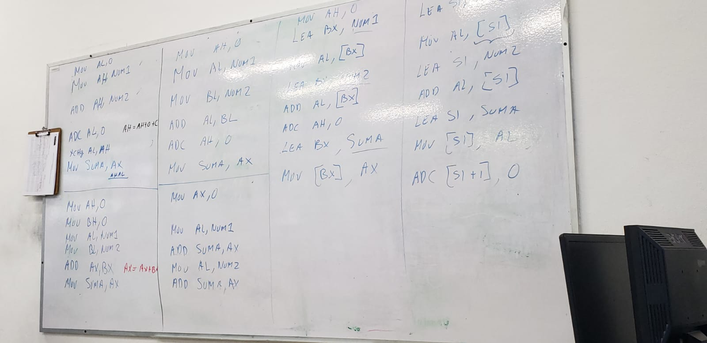

# Cápitulo 4

## INTRUCCIONES DE MOVIMIENTO

* MOV

* PUSH, POP; estas son instruscciones reelevantes ya que *almacenan* y *recuperan* datos de la memoria de pila. Existen 6 variaciones para cada una como lo serían de: *registro de memoria*, *inmediata*, *de registro de segmento*, *de bandera* y de *todos los registros*. Solo pueden utilizarse en los microprocesadores 80186 al Pentium 4. 

* LEA, LDS, LES, LFS,LGS.        Ejemplo de alternativa: MOV BX, OFFSET <VARIABLE>

* LODS, STOS

* MOVS

* INS,OUTS

* XCHG

* XLAT

* IN,OUT

## INS y OUTS
Estos son para los dispositivos de entrada y salida, no refiriendonos a su ambiente físico si no que tengan que ver con la arquitectura de la computadora.

## XCHC
Es para intercambio contenido deregistros 

AL<-Ds[BX+AL] estaforma es para que almacenede manera temporal AL.

## IN OUT
es para cadenas de puertos 

> Nota: 
> El **prefijo de sustitución de segmento** funciona de la siguiente manera:
> **BP**
> *MOV AL,[BP+SP]* no es lo mismo que DS+10H+BP+S
> LA MENRA CORRECTA ES 
> *SS+10H+BP+SI*

*Son switches para determinar el tipo de arquitectra que vamos a estar utilizando* en la **.287 y .387** son de manera que escogiamos el tipo de coprocesador matemático. 

>Nota 
>la imagen de arriba son directivas es decir procesa la directiva es decir en funcion de las directivas el compilador hace cosas al cógido y una vez jecutao no existen las directivas solo queda el código. 

# Capítulo 5

## Suma (ADD)
## Suma con acarreo

## Resta (SUB)
## Resta con acarreo  (SBB)

Existe una importante diferencia entre lo que es una Instrucción de ensamblador y una directiva de compilación.

Estudiar y entender en que consiste esta diferencia y revisar las directivas que aparecen en el libro de Brey capítulo 5 al final, en página 135 de la versión 7

Las que usaremos prácticamente de forma inmediata son:

ASSUME	Informa al ensamblador que debe nombrar cada segmento (segmentos completos solamente).
 	 
DB	Define byte(s) (8 bits).
DD	Define doble(s) palabra(s) (32 bits).
DW	Define palabra(s) (16 bits).
DQ	Define palabra(s) cuádruple(s) (64 bits).
DT	Define diez bytes (80 bits).
DUP	Genera duplicados.
EQU	Iguala datos o una etiqueta con otra etiqueta.
 	 
SEGMENT	Inicia un segmento para segmentos completos.
ENDS	Termina un segmento o estructura de datos.
STACK	Inicia un segmento de pila para segmentos completos.
DATA	Inicia un segmento de datos para segmentos completos.
ORG	Establece el origen dentro de un segmento.
 	 
PROC	Inicia un procedimiento.
ENDP	Termina un procedimiento.
 	 
OFFSET	Especifica una dirección de desplazamiento.
 	 
BYTE	Indica el tamaño de byte, como en BYTE PTR.
WORD	Indica el tamaño de palabra, como en WORD PTR.
DWORD	Indica el tamaño de doble palabra, como en DWORD PTR.
QWORD	Indica palabras octales, como en QWORD PTR.
 	 
FAR	Define un apuntador lejano, como en FAR PTR.
NEAR	Define un apuntador cercano, como en NEAR PTR.
 	 
END	Termina un archivo de programa.

INTRUCCIONES DE OPERACIONES LOGICAS Y ARITMETICAS

ARITMETICAS

LOGICAS	
DESPLAZAMIENTO Y

CORRIMIENTO

COMPARACION DE

CADENAS

ADD

AND	SHL	SCAS
INC	OR	SAL	CMPS
ADC	XOR	SHR	
SUB	TEST	SAR	
DEC	BT	RCL	
SBB	BTC	ROL	
CMP	BTR	RCR	
MUL	BTS	ROR	
IMUL	NOT		
DIV	NEG		
IDIV	

## Primer ejercicio de programción 

NUM1 BYTE
NUM2 BYTE

SUMAR AMBOS NUMEROS
SUME WORD

al ser esetas variables de memoria entonces debemos eclararlas 

en  la parte de segmento de datos hay que declarar 
num1 db
num2 d
suma dw
nosotros tenemos que ponerle un dato 
y suma podriamos ponerle un cero y hay que evitar el error de quedarse con un numero es decir hay que ponerlo de la sigueinte manera

num1 db  y
num2 d   x
suma dw  0 

entonces hay que tener en cuenta que haremos la suma y estos pueden crecer al siguiente escalon o sea un word y la suma de eso puede dar en que se de un dble word 

ahora cómo obtenemos os datos 

incertar foto que tome en clase

estos ejemplos están mal pero siguen una idea 

### seguir una idea 

MOV AL,NUM1
ADD AL,NUM2
*en ensambaldor los métodos tienen que ser muy rigidos porque está todo aun nivel muy pequeño*
por lo que hay qe seguir el método de suma con el acarreo 
por lo cual hay que llevar siempre neustro acarreo 

---
> MOV AH,0 *ESTO ES DEBIDO A QUE VA A FUNCIONAR COMO NUESTRO ACARREO*

> ADD AL,NUM2 *SUMAMOS A AL*

> ADC AH,0 LA INTERPÑRETACION ES ESTA FUNCION ES AH=AH+0+C

> MOV SUMA,AX LA INTERPRETACION ES QUE AX = AH,AL
---

PERO ES POSIBLE HACERLO AAL REVES

---
> MOV **AL**,0 *ESTO ES DEBIDO A QUE VA A FUNCIONAR COMO NUESTRO ACARREO*

> ADD **AH**,NUM2 *SUMAMOS A AL*

> ADC **AL**,0 LA INTERPÑRETACION ES ESTA FUNCION ES AH=AH+0+C

> XCHG AL,AH LA INTEPRETCIÓN ES ESTO ES INTERCAMBIAR EL CRUCE DE LOS NÚMEROS

> MOV SUMA,AX LA INTERPRETACION ES QUE AX = AH,AL
---

PERO PUEDEN HABER OTRAS FORMAS 

>NOTA *APARTIR DE ESTOS SIGUIENTES PASOS ENTONCES TENEMOS QUE SON YA TAMAÑO WORD POR LO QUE NO UTILIZAMOS LA FUNCIÓN ADC DE ACARREO

>MOV AH,0

>MOV BH,0

>MOV AL,NUM1

>MOV BL,NUM2

>ADD AX,BX LA INTERPRETACION ES ES AX=AX+BX

>MOV SUMA,AX

* OPCIÓN 3

>MOV AH 0

>MOV AL,NUM1

>MOV BL,NUM2

>ADD AL,BL

>ADC AH,0

>MOV SUMA,AX

* OPCIÓN 4

>MOV AX,0

>MOV AL,NUM1

>ADD SUMA,AX

>MOV AL,NUM2

>ADD SUMA, AX

AQUÍ EMPEZAMOS UTILIZANDO OTRO MÉTODO DE DIRECCIONAMIENTO LOS ANTERIORES SON DE MODO DIRECTO

INDIRECTO POR REGISTRO
>MOV AH,0 *este es el acarreo*

>LEA BX,NUM1 *la posición estamos usando *

>MOV AL,[BX]

>LEA BX,NUM2

>ADD AL,[BX]

>ADC AH,0

>LEA BX,SUMA

>MOV [BX],AX

opción 6
RELATIVO A LA BASE

> LEA SI,NUM1 *se opta por cambiar la variable*

> MOV AL,[SI]

> LEA SI,NUM2

> ADD AL,[SI]

> LEA SI,SUMA

>MOV[SI],AL*muervo a la parte baja de la suma*

>ADC[SI+1]0*y luego el acarreo lo sumo a esta*

la tarea que tenemos qué hacer es comprobar en el codificador
cuando declaremos nuestra varibale e el turbo deguer tenemos que comprobar el acarreo pero tenemso que probar con un 0ffh

quitar todo en el segmento de código y también en el segmento y por lo tanto tenemos que poner siempre las dos instrucciones para que sirva el código 

problema
 se tiene un arreglo con cinco número s t byte llamado array
 sumar todos los números y almacenar el resultdoo en ua variable de memoria tipo word 
 llamda suma

 hay que escoger un método de direccionamiento para acceder a los valores del arreglo

 Array DB 25H,3FH,78H,10H,15H 
 SUMA DW,0
 

 # Capítulo 5
 ## de instrucciones aritméticas y lógicas 

 **BT** Evalua nuestro bit si es cero o uno 
 
 **BTC** LO VUELVE 0 SI ES UNO Y LO CONTRARLO 
 BTR LO RESETEA A CERO

 NOT CH ES EL COMPLENMENTO O NEGACIÓN LÓGICA 

 ## INSTRUCCIONE DE DESPLAZAMIENCO SHL Y TAMBIÉN DE CORRIMIENTO 
    - LINEALES 
        - DESPLAZAMN LO SREGISTRODE DE MANERA LINEAL 
        aquí por ejemplo podriamos eciri que si mueve a la derecha el 256 le movemos hacia la izquierda entonces tendriamos 2560 eso quiere decir que multiplicamos por lab base. 
    - CIRCULARES
        - no pierden los bits
        a diferencia de los mivimoentos que hacia anteriormente este guarda el estado anterior que teniamos de dicha variable 

## Compraraciones de cadenas

### SCAS

- 

podemos observarque usa xor al,al pero eso podría ser lo mismo que mov al, 0 pero utilizamos xor para que sea de manrea directa 

el repne es que eseta repitiendo hata encontrar el igual es decir se detiene al llegar al 5 pero el 100 es como el número e intereaciones. 

### CMPS

hay CMPSB CMPSW CMPSD

esto hace quna búsqueda que contuna siempre  cuando exista una condición de igualdad.   

INTRUCCIONES DE OPERACIONES LOGICAS Y ARITMETICAS

ARITMETICAS

LOGICAS	
DESPLAZAMIENTO Y

CORRIMIENTO

COMPARACION DE

CADENAS

ADD

AND	SHL	SCAS
INC	OR	SAL	CMPS
ADC	XOR	SHR	
SUB	TEST	SAR	
DEC	BT	RCL	
SBB	BTC	ROL	
CMP	BTR	RCR	
MUL	BTS	ROR	
IMUL	NOT		
DIV	NEG		
IDIV	

    

## capitulo 6

## istrucciones de saltos

JA
JAE PARA QUE NO SE ACTIVEN LAS BANDREAS

JBE
JC
JE O JZ CUANOD NO SEA CERO O NO SE AIUGLA 
G JGE 

JLE 
JNC 
JNE O JNZ
JNO SI NO HAY SIGNO
JNS SI NO HAY PARIDAD
JNP O JPO 
JO
JP O JPE
JS 
JCX 

A = ABOVE, B= 

mov [] de esta manera esta escribiendo 

<!--  -->
mov __,[] es esta manera esta leyendo

Supongamos que tenmos dos números 

Uno en AL Y OTRO EN BL

SI LOS SUMAMOS Y LA SUMA ES MAYOR DE 10 O SEA 
SI SUMA > 10 , ENTONCES AL-BL
SI LA SUMA <=10, ENTONCES BL-AL 

ADD AL,BL
ADD SUMA,AL
CMP SUMA,10
JA, OTRO 
SUB AL-BL

SUB BL-AL 

En el registro AL hay un caracter ASCII

Si el caracter es Mayuscula BL el cacter que sigue al de registro AL 

Si el caracter es minúscula 
poner en BL el caracter siguiente

Poner en BL el caracter anterior al leido anterior al leido 

    
        **cmp al,61h;**aqui comparamos si al es mayor que 61h si se cumple se salta a otro pero si no pues sigue hacia abajo
        
        ja otro

            add al,1

            jm sale

    otro:   sub al,1

.

        CMP AL, "z" ;SI ES MAYOR O IGUAL 
        JBE MAYUSCULA
        cmp AL "z"
        ja no_esletra
            dec al
            jmp sale
mayuscula:  

MINUSCULA

**nos dejo un ejercicios el cual la solución para el primero es este:**

    var1 DB 01H
    var2 DB 010H

    result DW 0

    
    ;¿cómo moverlo a registro?

    ;add result, var1 esto no se puede hacer
    ;add result, var2

    ;entonces tenemos que hacer una operación para tener un resultado

    ;a un registro ponerle un valor 

    MOV AL,var1

    MOV BL,var2

    ADD AL,BL

    ADC AH,0

    MOV result,AX

        cmp AX,064H;aquí si resulto es mayor 
            JA mayor
            mov ax,0AH
            mov bx,05FH
            JA sale

    mayor:  mov ax,014H
            mov bx,AX

    Sale: 

 

    Array1 DB 0,1
    result Dw 0

    mov al,array1
    mov bl,array1+1
    mov cl,result
        cmp ax,bx

            JA mayor1
            ;aquí array1+1 es mayor
            add cx,ax
            add cx,bx
            JA sale

    mayor1: 
            sub cx,ax
            sub cx,bx

    sale:

# interrupciones de software 

# Notas de clase de 17 de noviembre 
hacer algun algortimo qaue onfom un passwordde 8 caracteres vamos vien se entiende de qué se trata elobjetivo es una interrupción entonces cuando se mueva el maus pues muevelo hasta que aparece tu paswrord o sea fue generado de manera aleatoria, eso también se tiene que hacer en dos lenguajes si es posible establecer un que no se pase por el tamaño en el programa anterior que hicimos mandar a un salto yo les resolve cómo resolver eso de forma pasada pes no sé la verdad era es hacer ese o el de contador pues no estamos obligados a hacerlo, cuál es el otro aspecto en el contador es libre el que haga cualquiera de los dos el del contador tiene un detallle adicional voy a agarrar el trabajo de todos los trabajos para ponerlos a competir para que el mejor en optimización pues gane algo de punto. Tiene un valor adicional no lo tiene de esa forma no son competibles sin embargo lo voy a checar y sin embargo pues si no na la verda me di ohuea escribir. nos va mostrar un poco cómo están esos programas, no tiene un ejemplo, nos va a mostrar cómo funciona lo dle mause es en pocición x y y y si nos vamos hacia allá estamos en la pocisión más baja en este lado va generando números que podemos utilizar para seleccionar un password tenemos que escoger caracteres validos cómo le vamos a hacer le hciste es que diseñar una manera de resolverlo cómo podemos usar esos valore para utilizar un password, es sensillo entoncees solo no hago la interrupción y lo que hacemos entonces pues es simplemente no hacer la interrución y podemos hacer la impresión para que pues dé, pues aqui'estmaso entonces tenemos que hacer eso en ambos lenguajes, hay una interrupción que nos da la hora del sistema, numero de lineas de código ya cons instrucciones de ensamblador tamaño del ejecutable en bytes y conteo
 
 numero de lineas de código
 tamaño del ejecutable
 y conteo en un minuto
